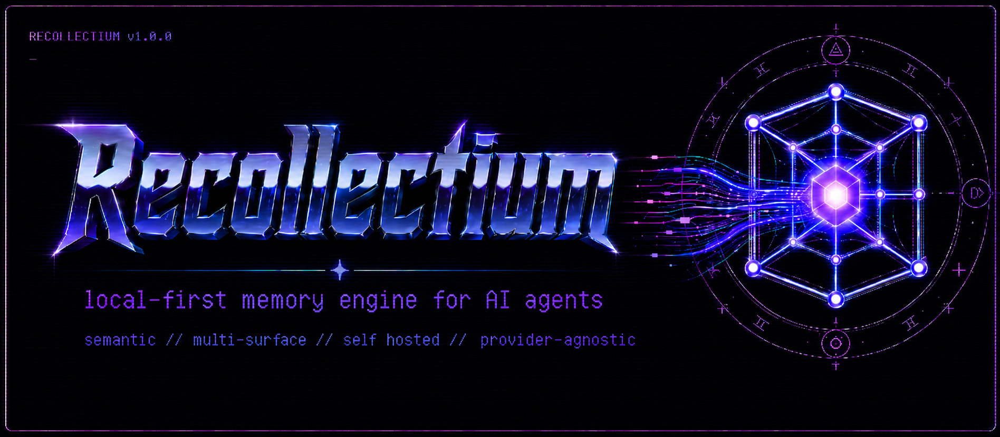

<p align="center">
  
</p>

# Recollectium

Local-first memory for AI agents.

## About

Recollectium is a Python-first, local-first memory framework for AI agents. It gives agents a durable place to store and search what should survive across chats, projects, and tools, without tying that memory to one client.

Recollectium Core owns the memory engine: SQLite storage, embeddings, search, migrations, local service APIs, MCP tools, service lifecycle, structured logging, and adapter-facing discovery. Adapters stay thin. They bring host context to Core, then let Core handle memory semantics.

OpenCode is an important first adapter target, but Recollectium is not built around one client. The goal is portable memory infrastructure for agents.

## Why another memory engine?

Most agent memory falls into one of a few awkward buckets: no durable memory, memory trapped inside one client, memory that mixes personal preferences with project facts, or memory that is hard to inspect and maintain.

Recollectium is built around a few simple ideas:

- Local-first by default.
- User memory and workspace memory are separate.
- Memory is inspectable, editable, searchable, archivable, and portable.
- The same Core is reachable through the CLI, Python API, local HTTP API, and MCP.
- Adapters should not reimplement memory logic or own durable memory state.
- Normal recall should be easy for agents: search by scope first, filter by type only when it helps.

## Quick start

Linux and macOS:

```bash
curl -LsSf https://raw.githubusercontent.com/AlfonsoDehesa/recollectium/main/install.sh | sh
```

Windows PowerShell:

```powershell
powershell -ExecutionPolicy Bypass -c "irm https://raw.githubusercontent.com/AlfonsoDehesa/recollectium/main/install.ps1 | iex"
```

For the full setup flow, including first memory, service startup, MCP, API, logs, and troubleshooting, see the [Quick Start](https://github.com/AlfonsoDehesa/recollectium/wiki/Quick-Start) in the wiki.

Common next steps:

- Install details: [Installation](https://github.com/AlfonsoDehesa/recollectium/wiki/Installation)
- Learn the model: [Concepts](https://github.com/AlfonsoDehesa/recollectium/wiki/Concepts)
- Configure Recollectium: [Configuration](https://github.com/AlfonsoDehesa/recollectium/wiki/Configuration)
- Use the CLI: [CLI Reference](https://github.com/AlfonsoDehesa/recollectium/wiki/CLI-Reference)
- Start services: [Service Management](https://github.com/AlfonsoDehesa/recollectium/wiki/Service-Management)
- Read logs: [Logs](https://github.com/AlfonsoDehesa/recollectium/wiki/Logs)
- Connect through MCP: [MCP Server](https://github.com/AlfonsoDehesa/recollectium/wiki/MCP-Server)
- Call the local API: [API Reference](https://github.com/AlfonsoDehesa/recollectium/wiki/API-Reference)

## What Recollectium gives you

- Local SQLite memory storage.
- Explicit `user` and `workspace` memory scopes.
- Canonical memory buckets for preferences, facts, decisions, task context, configuration, bug findings, and notes.
- Create, search, list, get, update, and archive memory operations.
- Local FastEmbed embeddings with `jinaai/jina-embeddings-v2-small-en`.
- Background re-embedding jobs and embedding status inspection.
- CLI, Python API, local HTTP API, and MCP surfaces.
- Managed API and MCP service lifecycle with discovery metadata for adapters.
- Structured JSON logging with rotation.
- Bootstrap install, package upgrade, safe uninstall, and shell completion.

## Documentation

Start with the wiki:

- [Wiki Home](https://github.com/AlfonsoDehesa/recollectium/wiki)
- [Quick Start](https://github.com/AlfonsoDehesa/recollectium/wiki/Quick-Start)
- [Installation](https://github.com/AlfonsoDehesa/recollectium/wiki/Installation)
- [Concepts](https://github.com/AlfonsoDehesa/recollectium/wiki/Concepts)
- [Configuration](https://github.com/AlfonsoDehesa/recollectium/wiki/Configuration)
- [Features and Commands](https://github.com/AlfonsoDehesa/recollectium/wiki/Features-and-Commands)
- [CLI Reference](https://github.com/AlfonsoDehesa/recollectium/wiki/CLI-Reference)
- [Service Management](https://github.com/AlfonsoDehesa/recollectium/wiki/Service-Management)
- [Logs](https://github.com/AlfonsoDehesa/recollectium/wiki/Logs)
- [MCP Server](https://github.com/AlfonsoDehesa/recollectium/wiki/MCP-Server)
- [API Reference](https://github.com/AlfonsoDehesa/recollectium/wiki/API-Reference)
- [Adapter and Plugin Integration](https://github.com/AlfonsoDehesa/recollectium/wiki/Adapter-and-Plugin-Integration)
- [Verified Supported Plugins](https://github.com/AlfonsoDehesa/recollectium/wiki/Verified-Supported-Plugins)
- [Troubleshooting](https://github.com/AlfonsoDehesa/recollectium/wiki/Troubleshooting)
- [FAQ](https://github.com/AlfonsoDehesa/recollectium/wiki/FAQ)

Repo docs that act as canonical contracts:

- [Local service API](docs/local-service-api.md)
- [OpenAPI JSON](docs/local-service-openapi.json)
- [OpenCode adapter contract](docs/opencode-adapter-contract.md)
- [Security policy](SECURITY.md)
- [Contributing guide](CONTRIBUTING.md)
- [Roadmap](ROADMAP.md)

## Local-first security model

Recollectium v1 services are local-first and unauthenticated. The recommended deployment is to run Recollectium on the same machine as the agent or client and keep services bound to localhost, usually `127.0.0.1`.

Binding the API or MCP service to a non-local interface can expose memory operations to anyone who can reach that interface. If you need split-machine access, use private networking with external access controls. For most users, Tailscale is the friendliest path.

Read [SECURITY.md](SECURITY.md) before changing service host settings or exposing Recollectium outside the local machine.

## Project status

Recollectium Core is in final v1.0 release preparation. Core is implemented; remaining release work is public wiki/docs polish and the final release sweep. OpenCode plugin implementation is planned after v1.

See [ROADMAP.md](ROADMAP.md) for the current release plan.

## Contributing

See [CONTRIBUTING.md](CONTRIBUTING.md) for the development workflow, quality gates, documentation rules, release checklist, and PR process.

Please do not publish sensitive vulnerability details in public issues. See [SECURITY.md](SECURITY.md) for security reporting guidance.

## License

Recollectium is licensed under the [GNU Affero General Public License v3.0](LICENSE).
