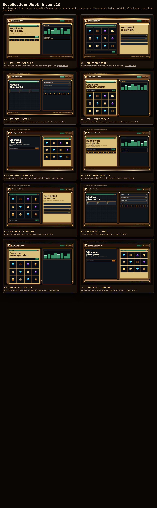
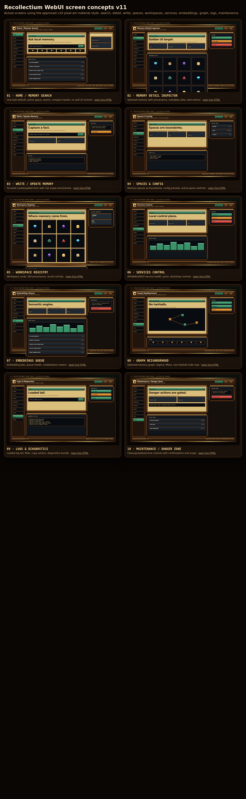

# Recollectium WebUI Visual Inspiration

This folder preserves the approved visual calibration for the Recollectium WebUI redesign.

The target is not a generic dashboard, not text-only retro styling, and not full fantasy-game cosplay. The approved direction is a modern, premium local control-plane layout with actual pixel-art UI construction: stepped tile frames, hard rectangular shading, dithered panels, sprite icons, inventory-slot cards, hotbar/filter rows, side tabs, brass/gold material, parchment wells, and dark inset surfaces.

## Approved style board

Use v10 as the material/style reference.

Files:

- Contact sheet: [`assets/webui-inspo/v10/contact-sheet-v10.png`](assets/webui-inspo/v10/contact-sheet-v10.png)
- Manifest: [`assets/webui-inspo/v10/manifest-v10.json`](assets/webui-inspo/v10/manifest-v10.json)
- Notes: [`assets/webui-inspo/v10/README.md`](assets/webui-inspo/v10/README.md)

## Approved screen concepts

Use v11 as the screen-coverage reference for actual WebUI surfaces.

Files:

- Contact sheet: [`assets/webui-inspo/v11-screens/contact-sheet-v11-screens.png`](assets/webui-inspo/v11-screens/contact-sheet-v11-screens.png)
- Manifest: [`assets/webui-inspo/v11-screens/manifest-v11-screens.json`](assets/webui-inspo/v11-screens/manifest-v11-screens.json)
- Notes: [`assets/webui-inspo/v11-screens/README.md`](assets/webui-inspo/v11-screens/README.md)

Screen concepts included:

1. Home / Memory Search
2. Memory Detail Inspector
3. Write / Update Memory
4. Spaces & Config
5. Workspace Registry
6. Services Control
7. Embeddings Queue
8. Graph Neighborhood
9. Logs & Diagnostics
10. Maintenance / Danger Zone

## Design rule of thumb

Preserve the v10/v11 material language through actual UI parts, not decorative overlays:

- Use pixel-art structure: stepped corners, hard-edge highlights, sprite icons, tiled borders, slot grids.
- Keep Recollectium screens task-focused and compact.
- Keep the app readable and operationally serious.
- Avoid fake pixelation through blurred screenshots, scanline-only shaders, or just pixel-font labels.
- Avoid full Win95/DOS/fantasy-RPG cosplay unless explicitly requested.
